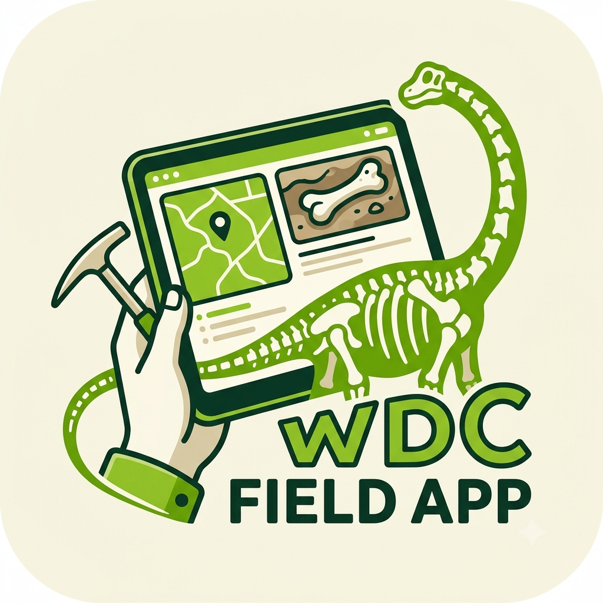

# WDC Field Collection App

A progressive web app (PWA) for field specimen collection at the **Wyoming Dinosaur Center**. Built for iPad and iPhone, works offline in the field, and syncs to a cloud database when connectivity is available.



---

## Overview

Field teams use this app to log paleontological specimens at the moment of discovery. Every record follows the [Darwin Core](https://dwc.tdwg.org/) standard with the [PaleoContext extension](https://tdwg.github.io/paleo/), making WDC data compatible with iDigBio, GBIF, and the Paleobiology Database without transformation.

---

## Features

- **Offline-first** — works with no connectivity; syncs automatically when back online with item count feedback
- **Darwin Core aligned** — all fields map directly to DwC / PaleoContext terms
- **Audit log** — every change to sites and specimens is recorded with full before/after snapshots and user attribution
- **GPS + compass capture** — tap to fill coordinates and specimen orientation from device sensors
- **Photo management** — capture or pick photos, queued offline and synced when connectivity returns
- **Role-based access** — six roles enforced at the database level via Row Level Security
- **Radial map points** — up to 4 reference point measurements (A–D) per specimen
- **Auto catalog numbers** — format `{SITE}-{YYYY}-{###}`, scans existing records to prevent duplicates
- **Paginated specimen list** — 8 most recent specimens shown, with Load More for older records
- **Dark mode** — follows device system preference automatically
- **Soft-delete sites** — archive sites without losing data; archived sites hidden from field view

---

## Tech Stack

| Layer | Service |
|-------|---------|
| Database & Auth | [Supabase](https://supabase.com) (PostgreSQL + Auth + Storage) |
| Hosting | [GitHub Pages](https://pages.github.com) |
| Standards | Darwin Core · PaleoContext Extension |
| Runtime | Vanilla JS PWA — no framework, no build step |

---

## Project Structure

```
wdc-field/
├── index.html              # Complete single-file PWA
├── sw.js                   # Service worker (stale-while-revalidate caching)
├── manifest.json           # PWA manifest for home screen install
├── WDC_fieldApp.png        # Splash screen / app icon
├── supabase-schema.sql     # Full database schema — run once in Supabase SQL Editor
├── SCHEMA.md               # Complete schema reference and Darwin Core crosswalk
└── README.md               # This file
```

---

## Database Schema

The schema lives in `supabase-schema.sql`. Six tables:

| Table | DwC Class | Description |
|-------|-----------|-------------|
| `profiles` | — | Users, roles, contact info |
| `locations` | Location | Dig sites (soft-deletable via `is_archived`) |
| `occurrences` | Occurrence + Event + Taxon + GeologicContext | Specimen records |
| `custody_events` | — | Immutable chain-of-custody log |
| `media` | associatedMedia | Photos and files |
| `audit_log` | — | Full before/after snapshots of every change to locations and occurrences |

See `SCHEMA.md` for the full field-by-field reference including Darwin Core term mappings.

---

## Setup

### 1. Database

1. Create a [Supabase](https://supabase.com) project
2. Open **SQL Editor** → paste the contents of `supabase-schema.sql` → **Run**
3. Go to **Authentication → URL Configuration** and set:
   - **Site URL**: `https://{your-github-org}.github.io`
   - **Redirect URLs**: `https://{your-github-org}.github.io/**`
4. Create your account via the admin app invite flow, then promote yourself:
   ```sql
   update profiles set role = 'admin'::user_role
   where email = 'your@email.com';
   ```

### 2. App configuration

Update the Supabase credentials in `index.html` (top of the `<script>` block):

```javascript
const SUPABASE_URL  = 'https://your-project.supabase.co';
const SUPABASE_ANON = 'your-anon-public-key';
```

### 3. Deploy

Push to GitHub. Enable **GitHub Pages** from the repo settings (source: main branch, root directory). The app is live at `https://{org}.github.io/{repo}/`.

---

## User Roles

| Role | Description |
|------|-------------|
| `intern` | Field data entry; create and edit own records |
| `staff` | Field data entry; create and edit own records |
| `registrar` | Collections management; read audit log |
| `management` | Edit any record; archive sites; read audit log |
| `researcher` | Read access |
| `admin` | Full access; manage users via admin app |

All permissions are enforced by Supabase Row Level Security — not just the UI.

---

## New User Onboarding

Users are invited from the admin app. The invite generates a magic link that directs the new user to `onboard.html` (hosted in the admin repo) to set their name, phone, mailing address, and password before being routed to the appropriate app.

---

## Offline Behaviour

The service worker uses a **stale-while-revalidate** strategy for the app shell — the cached version loads instantly while the latest version is fetched in the background for the next visit. Supabase API calls are network-first with an offline JSON fallback. All data changes made offline are queued in localStorage and synced automatically on reconnect.

---

## Darwin Core Alignment

Field app labels map to standard DwC terms:

| App Label | Database Column | Darwin Core Term |
|-----------|----------------|-----------------|
| Specimen # | `"catalogNumber"` | catalogNumber |
| Date Discovered | `"eventDate"` | eventDate |
| Collector | `"recordedBy"` | recordedBy |
| Taxon | `scientific_name` | scientificName |
| Formation | `formation` | formation |
| Associations | `associated_occurrences` | associatedOccurrences |
| GPS | `decimal_latitude` / `decimal_longitude` | decimalLatitude / decimalLongitude |

Full crosswalk in `SCHEMA.md`.

---

## Roadmap

- [x] Phase 1 — Field Collection App (this app)
- [ ] Phase 2 — Preparation Lab App
- [ ] Phase 3 — Collections Catalog App
- [ ] Phase 4 — Admin & Reporting
- [ ] Phase 5 — Public Research Portal

---

## Contributing

This project is developed for the Wyoming Dinosaur Center. All specimen data is proprietary to WDC.

---

*Wyoming Dinosaur Center · Thermopolis, Wyoming*
